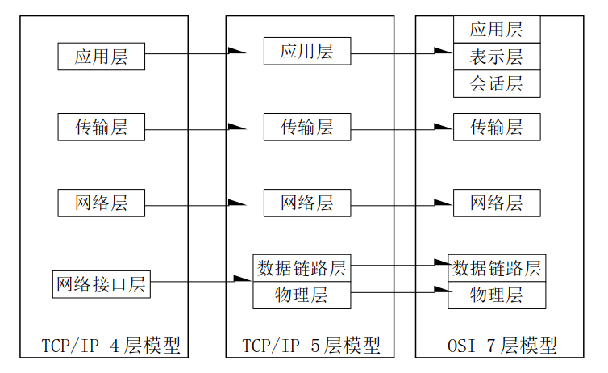
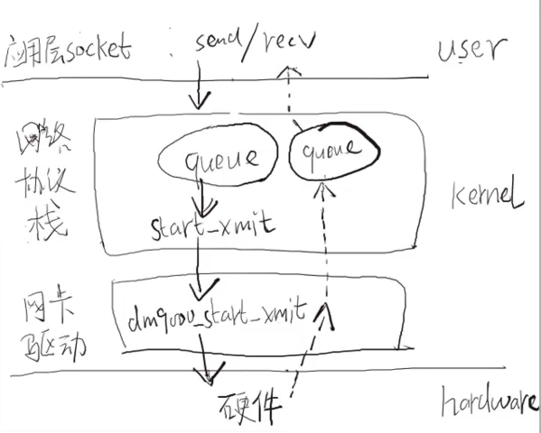
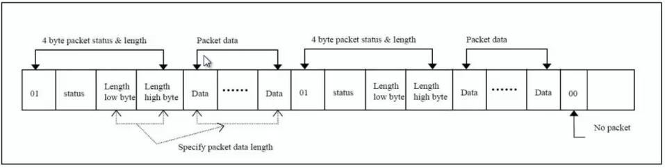
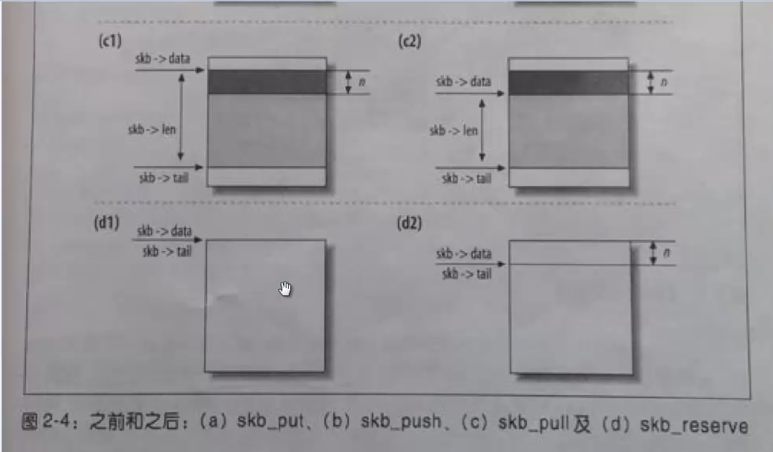

<font face=simsun size=4>

# Linux网络子系统

1. 应用层socket编程回顾

2. 网络嗅探工具wireshark使用

3. 网络协议栈概述
    - 网络协议模型 以太网帧格式  
        OSI七层模型  
        TCP/IP四层模型  
        TCP/IP五层模型  
          
    ***<u>TCP/IP 协议栈在内核中 ！</u>***
    
4. DM9000驱动分析
    > 程序路径在 linux-4.15/drivers/net/ethernet/davicom/dm9000.c  

    - 最外层platform架构分析
    ```C
    static struct platform_driver dm9000_driver = {
        .driver = {
            .name    = "dm9000",
            .pm  = &dm9000_drv_pm_ops,
            .of_match_table = of_match_ptr(dm9000_of_matches),
        },   
        .probe   = dm9000_probe,
        .remove  = dm9000_drv_remove,
    };
    ```
    在内核代码中使用grep全局搜索 "\"dm9000\""找到设备注册路径./arch/arm/mach-s3c24xx/mach-mini2440.c
    ```C
    // 设备结构体定义
    static struct platform_device mini2440_device_eth = { 
        .name       = "dm9000",
        .id     = -1, 
        .num_resources  = ARRAY_SIZE(mini2440_dm9k_resource),
        .resource   = mini2440_dm9k_resource,
        .dev        = {
            .platform_data  = &mini2440_dm9k_pdata,
        },  
    };

    // 在平台设备数组中加入设备结构体地址
    static struct platform_device *mini2440_devices[] __initdata = {
        ...
        &mini2440_device_eth,
        ...
    }

    // 
    static void __init mini2440_init(void)
    {
        ...
        platform_add_devices(mini2440_devices, ARRAY_SIZE(mini2440_devices));
        /*
         * @ platform_add_devices - add a numbers of platform devices
         * 
         * int platform_add_devices(struct platform_device **devs, int num)
         * {
         *     ...
         *     for(i = 0; i < num; i++){
         *         ret = platform_device_register(devs[i]);
         *         ...
         *     }
         *     ...
         * }
         */
        ...
    }
    ```
    ***dm9000设备资源 ./arch/arm/mach-s3c24xx/mach-mini2440.c***
    ```C
    static struct resource mini2440_dm9k_resource[] = {     // 两个内存资源 一个是地址接口，另一个是数据接口
        // 内存资源
        [0] = DEFINE_RES_MEM(MACH_MINI2440_DM9K_BASE, 4),   // MACH_MINI2440_DM9K_BASE  (S3C2410_CS4 + 0x300)
        /*
         * #define DEFINE_RES_MEM(_start, _size)    DEFINE_RES_MEM_NAMED((_start), (_size), NULL)
         *    #define DEFINE_RES_MEM_NAMED(_start, _size, _name)    DEFINE_RES_NAMED((_start), (_size), (_name), IORESOURCE_MEM)
                #define DEFINE_RES_NAMED(_start, _size, _name, _flags)          \
                    {                                       \
                        .start = (_start),                  \
                        .end = (_start) + (_size) - 1,      \
                        .name = (_name),                    \
                        .flags = (_flags),                  \
                        .desc = IORES_DESC_NONE,            \
                    }
         */
        // [0] = DEFINE_RES_MEM(MACH_MINI2440_DM9K_BASE, 4)
        // ---> DEFINE_RES_MEM_NAMED((MACH_MINI2440_DM9K_BASE), (4), NULL)
        // ---> DEFINE_RES_NAMED((MACH_MINI2440_DM9K_BASE), (4), (NULL), IORESOURCE_MEM)
        /*
            {
                .start = (MACH_MINI2440_DM9K_BASE),
                .end = (MACH_MINI2440_DM9K_BASE) + (4) - 1,
                .name = (NULL),
                .flags = (IORESOURCE_MEM),
                .desc = IORES_DESC_NONE,
            }
        */

        // 内存资源
        [1] = DEFINE_RES_MEM(MACH_MINI2440_DM9K_BASE + 4, 4),

        // IRQ资源
        [2] = DEFINE_RES_NAMED(IRQ_EINT7, 1, NULL, IORESOURCE_IRQ \
                            | IORESOURCE_IRQ_HIGHEDGE),
        /*
            {
                .start = (IRQ_EINT7),
                .end = (IRQ_EINT7) + (1) - 1,
                .name = (NULL),
                .flags = (IORESOURCE_IRQ | IORESOURCE_IRQ_HIGHEDGE),
                .desc = IORES_DESC_NONE,
            }
        */
    };
    ```
    - 驱动初始化
        > drivers/net/ethernet/davicom/dm9000.c
        ```C
            module_platform_driver(dm9000_driver);
            // #define module_platform_driver(__platform_driver)   \
            //                module_driver(__platform_driver, platform_driver_register, platform_driver_unregister)
            
            /*
                #define module_driver(__driver, __register, __unregister, ...) \
                static int __init __driver##_init(void) \
                { \
                    return __register(&(__driver) , ##__VA_ARGS__); \
                } \
                module_init(__driver##_init); \
                static void __exit __driver##_exit(void) \
                { \
                    __unregister(&(__driver) , ##__VA_ARGS__); \
                } \
                module_exit(__driver##_exit);
            */

            // module_platform_driver(dm9000_driver);
            // ---> module_driver(dm9000_driver, platform_driver_register, platform_driver_unregister)
            /* --->
                static int __init dm9000_driver_init(void)
                {
                    return platform_driver_register(&(dm9000_driver) , __VA_ARGS__);
                }
                module_init(dm9000_driver_init);

                static void __exit dm9000_driver_exit(void)
                {
                    platform_driver_unregister(&(dm9000_driver) , __VA_ARGS__);
                }
                module_exit(dm9000_driver_exit);
            */
        ```
        ***<u>platform平台总线设备驱动，匹配成功后调用prob函数,在probe函数中完成真正的注册与初始化</u>***
    - ***<u>probe()函数分析</u>***

        ```C
        static int dm9000_probe(struct platform_device *pdev)
        {
            struct dm9000_plat_data *pdata = dev_get_platdata(&pdev->dev);

            // board_info定义的是板子的信息 在dm9000.c中定义 
            struct board_info *db;  /* Point a board information structure */
            /*
                struct board_info(
                    void __iomem *io_addr;  // Register I/O base address
                    void __iomem *io_data;  // Data I/O address
                    u16 irq;
                    ...
                    void (*inblk)(void __iomem *port, void *data, int length);
                    void (*outblk)(void __iomem *port, void *data, int length);
                    void (*dumpblk)(void __iomem *port, int length);
                    
                    struct device *dev; // 基类

                    // 资源描述结构体
                    struct resource *addr_res;
                    struct resource *data_res;
                    struct resource *addr_req;
                    struct resource *data_req;
                    ...
                )
            */
            struct net_device *ndev;    // 表示一个网卡设备，系统中有多少个网卡设备就会有多少个net_device结构体描述网卡
            ...
            // 1. 申请 struct net_device 与 struct board_info 结构体
            /* Init network device */
            ndev = alloc_etherdev(sizeof(struct board_info));
            ...
            /* setup board info structure */
            db = netdev_priv(ndev);
            ...
            // 2. 从platform_device获取资源，包括 1)得到表示dm9000 data和address的地址，并建立映射之后，代表data和address的内存才可以使用
            db->addr_res = platform_get_resource(pdev, IORESOURCE_MEM, 0);
            db->data_res = platform_get_resource(pdev, IORESOURCE_MEM, 1);
            ...
            db->irq_wake = platform_get_irq(pdev, 1);
            ...
            // 
            iosize = resource_size(db->addr_res);
            /*
                static inline resource_size_t resource_size(const struct resource *res)
                {
                    return res->end - res->start + 1;   
                }
            */
            db->addr_req = request_mem_region(db->addr_res->start, iosize, pdev->name);
            // 判断资源地址是否已经被使用，若已经被使用则返回空，否则将这段地址标记为已使用
            // 防止不同的驱动同时使用相同的地址
            // 若成功执行 addr_req == addr_res & data_req == data_res
            ...

            // 完成内存映射 CPU使用虚拟地址访问设备
            db->io_addr = ioremap(db->addr_res->start, iosize);
            // 访问DM9000 实际使用的是io_add 这个虚拟地址，CPU只能使用虚拟地址！
            ...
            // 与addr相同的方式将data地址映射到虚拟地址
            iosize = resource_size(db->data_res);
            db->data_req = request_mem_region(db->data_res->start, iosize, pdev->name);
            ...
            db->io_data = ioremap(db->data_res->start, iosize);
            // CPU 使用io_addr 与io_data访问dm9000网卡
            ...
            // 3. 根据情况设定board 的读写函数
            /* ensure at least we have a default set of IO routines */
            dm9000_set_io(db, iosize);  // 根据不同的size大小对db中的 dumpblk outblk inblk操作函数进行赋值，但是没有意义
            // 后续的程序根据pdata中的内容对操作函数进行设置
            /* check to see if anything is being over-ridden */
            if (pdata != NULL) {
                ...
            }
            /*
                struct dm9000_plat_data *pdata = dev_get_platdata(&pdev->dev);
                static inline void *dev_get_platdata(const struct device *dev)
                {
                    return dev->platform_data;
                }
                @ padta = pdev->dev->platform_data;
                    具体内容见 arch/arm/mach-s3c24xx/mach-mini2440.c中dm9000 device结构体
            */
            ...
            // 4. 对网卡进行软件重启
            dm9000_reset(db);   // 通过操作dm9000寄存器实现
            /*
                static void iow(struct board_info *db, int reg, int value)
                {
                    writeb(reg, db->io_addr);
                    writeb(value, db->io_data);
                }

                static u8 ior(struct board_info *db, int reg)
                {
                    writeb(reg, db->io_addr);
                    return readb(db->io_data);
                }
            */
            ...
            // 5. 读取并验证网卡的vendor id和device id
            for (i = 0; i < 8; i++) {
                id_val  = ior(db, DM9000_VIDL);
                id_val |= (u32)ior(db, DM9000_VIDH) << 8;
                id_val |= (u32)ior(db, DM9000_PIDL) << 16;
                id_val |= (u32)ior(db, DM9000_PIDH) << 24;
            
                if (id_val == DM9000_ID)
                    break;
                dev_err(db->dev, "read wrong id 0x%08x\n", id_val);
            }
            ...
            id_val = ior(db, DM9000_CHIPR);
            ...
            switch (id_val) {   // 验证的动作
            case CHIPR_DM9000A:
                db->type = TYPE_DM9000A;
                break;
            case CHIPR_DM9000B:
                db->type = TYPE_DM9000B;
                break;
            default:
                dev_dbg(db->dev, "ID %02x => defaulting to DM9000E\n", id_val);
                db->type = TYPE_DM9000E;
            }
            ...
            // 6. 读取网卡的chip revision并根据不同的revision赋值
            // 见具体内核代码
            ...
            // 7. 开始初始化net_device，设计到很多网卡硬件细节
            // 定义 fops
            ndev->netdev_ops    = &dm9000_netdev_ops;
            ndev->ethtool_ops   = &dm9000_ethtool_ops;  // 支持上层的ethtool工具
            /*
                static const struct net_device_ops dm9000_netdev_ops = {
                    .ndo_open       = dm9000_open,
                    .ndo_stop       = dm9000_stop,
                    .ndo_start_xmit     = dm9000_start_xmit,
                    .ndo_tx_timeout     = dm9000_timeout,
                    .ndo_set_rx_mode    = dm9000_hash_table,
                    .ndo_do_ioctl       = dm9000_ioctl,
                    .ndo_set_features   = dm9000_set_features,
                    .ndo_validate_addr  = eth_validate_addr,
                    .ndo_set_mac_address    = eth_mac_addr,
                #ifdef CONFIG_NET_POLL_CONTROLLER
                    .ndo_poll_controller    = dm9000_poll_controller,
                #endif
                };
                static const struct ethtool_ops dm9000_ethtool_ops = {       
                    .get_drvinfo        = dm9000_get_drvinfo,
                    .get_msglevel       = dm9000_get_msglevel,
                    .set_msglevel       = dm9000_set_msglevel,
                    .nway_reset     = dm9000_nway_reset,
                    .get_link       = dm9000_get_link,  
                    .get_wol        = dm9000_get_wol,   
                    .set_wol        = dm9000_set_wol,   
                    .get_eeprom_len     = dm9000_get_eeprom_len,
                    .get_eeprom     = dm9000_get_eeprom,
                    .set_eeprom     = dm9000_set_eeprom,
                    .get_link_ksettings = dm9000_get_link_ksettings,
                    .set_link_ksettings = dm9000_set_link_ksettings, 
                };
            */
            // 设置 mac 地址
            if (!is_valid_ether_addr(ndev->dev_addr) && pdata != NULL) {
                mac_src = "platform data";
                memcpy(ndev->dev_addr, pdata->dev_addr, ETH_ALEN);
                // 将 pdata->dev_addr中的数据设为mac地址
            }
            ...
            // 8. register_netdev注册网卡设备
            platform_set_drvdata(pdev, ndev);
            ret = register_netdev(ndev);
            ...
        }
        ```
    - ***<u>open()函数分析</u>***
        > 网卡驱动的fops结构体  
        ```C
        static const struct net_device_ops dm9000_netdev_ops = {
            .ndo_open       = dm9000_open,  // open函数
            .ndo_stop       = dm9000_stop,
            .ndo_start_xmit     = dm9000_start_xmit,
            .ndo_tx_timeout     = dm9000_timeout,
            .ndo_set_rx_mode    = dm9000_hash_table,
            .ndo_do_ioctl       = dm9000_ioctl,
            .ndo_set_features   = dm9000_set_features,
            .ndo_validate_addr  = eth_validate_addr,
            .ndo_set_mac_address    = eth_mac_addr,
        #ifdef CONFIG_NET_POLL_CONTROLLER
            .ndo_poll_controller    = dm9000_poll_controller,
        #endif
        };
        ```

        ***<u>普通的字符设备会在/dev/路径下有一个设备节点，应用程序通过系统调用open()函数调用设备驱动中的open()函数</u>***  
        ***<u>但是网卡设备没有设备节点，也无法手动创建设备节点</u>***  

          
        应用层与网卡驱动之间隔了一个协议栈，所以应用层无法直接通过系统调用使用驱动程序接口，驱动程序的接口都通过协议栈调用
        ```shell
        $ ifconfig eth0 up
        $ ifconfig eth0 down    # 协议栈启动/关闭网卡
                                # 执行 ifconfig eth0 down 时 协议栈 调用 dm9000_stop 函数关闭网卡
                                # 执行 ifconfig eth0 up 时 协议栈 调用 dm9000_open 函数打开网卡
        ```
        
        > open()函数分析
        ```C
        static int dm9000_open(struct net_device *dev)
        {
            struct board_info *db = netdev_priv(dev);
            /*
                static inline void *netdev_priv(const struct net_device *dev)
                {
                    return (char *)dev + ALIGN(sizeof(struct net_device), NETDEV_ALIGN);
                }
            */
            unsigned int irq_flags = irq_get_trigger_type(dev->irq);
            /*
                static inline u32 irq_get_trigger_type(unsigned int irq)
                {
                    struct irq_data *d = irq_get_irq_data(irq);
                    return d ? irqd_get_trigger_type(d) : 0;
                }
            */
            ...
            irq_flags |= IRQF_SHARED;   // 设置共享中断资源的标记
            ...
            // 向网卡配置寄存器写入数据配置网卡工作方式
            ...
            if (request_irq(dev->irq, dm9000_interrupt, irq_flags, dev->name, dev))
                return -EAGAIN;         // 注册中断 dm9000_interrupt为中断处理程序
            ...
            // 允许发送数据 - 允许上层调用设备 hard_start_xmit 程序 (routine 例程)
            // 即 网卡fops结构体定义中的 .ndo_start_xmit     = dm9000_start_xmit,操作函数
            // 但这个函数在网络协议栈中调用
            /*
                static int dm9000_start_xmit(struct sk_buff *skb, struct net_device *dev)
                // 网络协议栈中一个sk_buff 表示一个网络数据包
            */
            netif_start_queue(dev);
        }
        ```

    - 网卡驱动的发送过程

        <u>***发送流程***</u>

        ```mermaid
        graph LR
        应用层socket-send函数 --> 网络协议栈queue --start_xmit--> 驱动层 -- dm9000_start_xmit --> 硬件层
        ```

        > 当上层应用层程序通过socket接口send()函数发送数据时，数据首先会传到网络协议栈的等待队列，网络协议栈会将应用层的数据先放到一个sk_buffer中，然后才会调用start_xmit函数  
        > sk_buffer是一个完整的数据包，包括以太网头部、IP头部、TCP头部和用户数据
        ```C
        struct sk_buff{
            ...
            sk_buff_data_t      tail;
            sk_buff_data_t      end;
            unsigned char       *head, *data;   // data 指针指向真实的数据封装
            unsigned int        truesize;
            refcount_t      users;
        }
        ```
        > <u>***` static int dm9000_start_xmit(struct sk_buff *skb, struct net_device *dev) 函数解析 `***</u>
        ```C
        static int dm9000_start_xmit(struct sk_buff *skb, struct net_device *dev)
        {
            ...
            if (db->tx_pkt_cnt > 1)     // 判断当前 dm9000 网卡中已经存在的等待发送的数据封包，dm9000 网卡支持最多两个数据封包等待发送
                return NETDEV_TX_BUSY;
            ...
            /* Move data to DM9000 TX RAM */
            writeb(DM9000_MWCMD, db->io_addr);  // 将 DM9000_MWCMD 写入到 db->io_addr
            /*
                #define writeb(v,c)     ({ __iowmb(); writeb_relaxed(v,c); })

                #define __raw_writeb __raw_writeb
                static inline void __raw_writeb(u8 val, volatile void __iomem *addr)
                {
                    asm volatile("strb %1, %0"
                        : : "Qo" (*(volatile u8 __force *)addr), "r" (val));
                }
            */
            // 通过操作 DM9000_MWCMD(Memory data write command with address increment Register, Write data to Tx SRAM)
            
            (db->outblk)(db->io_data, skb->data, skb->len); // 调用db->outblk()函数将 skb->data 写入到db->io_data中，写入长度为skb->len
            // outblk指向的函数已经在probe函数中初始化完成
            ...
            db->tx_pkt_cnt++;       // Tx等待数据包计数值自加
            ...
            /* TX control: First packet immediately send, second packet queue */ 
            if (db->tx_pkt_cnt == 1) {          
                dm9000_send_packet(dev, skb->ip_summed, skb->len);
                /*
                    static void dm9000_send_packet(struct net_device *dev, int ip_summed, u16 pkt_len)
                    {
                        struct board_info *dm = to_dm9000_board(dev);

                        // The DM9000 is not smart enough to leave fragmented packets alone.
                        if (dm->ip_summed != ip_summed) {
                            if (ip_summed == CHECKSUM_NONE)
                                iow(dm, DM9000_TCCR, 0);
                            else
                                iow(dm, DM9000_TCCR, TCCR_IP | TCCR_UDP | TCCR_TCP);
                            dm->ip_summed = ip_summed;
                        }
                        // 以上if语句不运行

                        // Set TX length to DM9000
                        // DM9000 需要知道发送的数据包长度值

                        iow(dm, DM9000_TXPLL, pkt_len);
                        // 将 DM9000_TXPLL写入 io_addr，将 pkt_len写入 io_data ---> 将 pkt_len写入 DM9000_TXPLL
                        iow(dm, DM9000_TXPLH, pkt_len >> 8);
                        // 将 DM9000_TXPLH写入 io_addr，将 (pkt_len >> 8)写入 io_data ---> 将 (pkt_len >> 8)写入 DM9000_TXPLH

                        // Issue TX polling command
                        iow(dm, DM9000_TCR, TCR_TXREQ);
                        // DM9000_TCR[0]位置1， 发送完成后硬件自动清除
                        // 发送完成后产生中断，通过判断中断源检测时候完成发送过程
                    }
                */
            } else {        // tx_pkt_cnt 计数值大于1
                            // 表示当前 DM9000中的Tx RAM空间已满
                /* Second packet */
                db->queue_pkt_len = skb->len;
                db->queue_ip_summed = skb->ip_summed;
                netif_stop_queue(dev);      // 通知上层协议栈不要再通过调用 start_xmit()函数发送数据
                /*
                    static inline void netif_stop_queue(struct net_device *dev)
                    {
                        netif_tx_stop_queue(netdev_get_tx_queue(dev, 0));
                    }
                */
            }
        }
        ```
        - DM9000中断处理程序
            ```C
            static irqreturn_t dm9000_interrupt(int irq, void *dev_id)
            {
                ...
                /* Got DM9000 interrupt status */
                int_status = ior(db, DM9000_ISR);   /* Got ISR (Interrupt Status Register)*/
                iow(db, DM9000_ISR, int_status);    /* Clear ISR status 清中断*/
                ...
                /* Transmit Interrupt check */
                if (int_status & ISR_PTS)
                    dm9000_tx_done(dev, db);
                    /*
                        static void dm9000_tx_done(struct net_device *dev, struct board_info *db)
                        {
                            int tx_status = ior(db, DM9000_NSR);    // 读 DM9000_NSR寄存器

                            if (tx_status & (NSR_TX2END | NSR_TX1END)) {    // DM9000 同一时刻可以存放两个待发送的封包
                                // One packet sent complete
                                db->tx_pkt_cnt--;
                                dev->stats.tx_packets++;

                                if (netif_msg_tx_done(db))
                                    dev_dbg(db->dev, "tx done, NSR %02x\n", tx_status);

                                // Queue packet check & send
                                if (db->tx_pkt_cnt > 0)             // DM9000中还有待发送的数据
                                    dm9000_send_packet(dev, db->queue_ip_summed, db->queue_pkt_len);
                                netif_wake_queue(dev);              // 通知协议栈可以继续通过 hard_start_xmit()发送数据
                            }
                        }
                    */
                ...
            }
            ```

            > 驱动层通知协议栈停止发送忙等待和继续发送函数
            ```C
            netif_wake_queue(dev);              // 通知协议栈可以继续通过 hard_start_xmit()发送数据

            netif_stop_queue(dev);      // 通知上层协议栈不要再通过调用 start_xmit()函数发送数据
            ```
    - 网卡驱动的接收过程
        > 函数 `static void dm9000_rx(struct net_device *dev)`详解  
        > DM9000 硬件数据格式 RxRAM空间比TxRAM大
        > RxRAM数据格式
        
        
        ```C
        static void dm9000_rx(struct net_device *dev)
        {
            ...
            do
            {
                ...
                /* 1. 读取第一个字节，需要用到MRCMDX寄存器(地址不自加) */

                rxbyte = readb(db->io_data);    // 读内部RxRAM 读一个字节

                if (rxbyte & DM9000_PKT_ERR) {  // 检查是否是错误数据
                dev_warn(db->dev, "status check fail: %d\n", rxbyte);
                iow(db, DM9000_RCR, 0x00);  /* Stop Device */
                return;
                }

                if (!(rxbyte & DM9000_PKT_RDY)) // RxRAM中第一个字节为0x01
                    return ;
                
                ...

                // 检查数据尺寸是否符合以太网协议   以太网数据帧为64~1536 Byte
                if (RxLen < 0x40) {
                    GoodPacket = false;
                    if (netif_msg_rx_err(db))
                        dev_dbg(db->dev, "RX: Bad Packet (runt)\n");
                }

                if (RxLen > DM9000_PKT_MAX) {   // #define DM9000_PKT_MAX 1536
                    dev_dbg(db->dev, "RST: RX Len:%x\n", RxLen);
                }

                ...
                /* rxhdr.RxStatus is identical to RSR register. */
                /* 2. 读取头部并放到 struct dm9000_rxhdr中 */
                // 检查RxRAM 中的头部数据
                if (rxhdr.RxStatus & (RSR_FOE | RSR_CE | RSR_AE | RSR_PLE | RSR_RWTO | RSR_LCS | RSR_RF)) {
                    GoodPacket = false;
                if (rxhdr.RxStatus & RSR_FOE) {
                    if (netif_msg_rx_err(db))
                        dev_dbg(db->dev, "fifo error\n");
                    dev->stats.rx_fifo_errors++;
                }
                if (rxhdr.RxStatus & RSR_CE) {
                    if (netif_msg_rx_err(db))
                        dev_dbg(db->dev, "crc error\n");
                    dev->stats.rx_crc_errors++;
                }
                if (rxhdr.RxStatus & RSR_RF) {
                    if (netif_msg_rx_err(db))
                        dev_dbg(db->dev, "length error\n");
                    dev->stats.rx_length_errors++;
                    }
                }
                ...
                // 数据正确性检查通过，正常读取网卡数据
                /* 3. 读取包中的数据 */
                ...
                /* 4. 分配一个 struct sk_buffer, 将包中的数据保存至sk_buffer */

                /* 5. 调用 netif_rx(skb); 将sk_buffer 提交到协议栈 */

            }while(rxbyte & DM9000_PKT_RDY);
        }
        ```
5. Linux loopback驱动详解
    > 代码参考./drivers/net/loopback.c
    - loopback网卡 初始化
    ```C
    static __net_init int loopback_net_init(struct net *net)
    {
        ...
        dev = alloc_netdev(0, "lo", NET_NAME_UNKNOWN, loopback_setup);
        /*
            #define alloc_netdev(sizeof_priv, name, name_assign_type, setup)    alloc_netdev_mqs(sizeof_priv, name, name_assign_type, setup, 1, 1)

            // Allocates a struct net_device with private data area for driver use
            // and performs basic initialization.  Also allocates subqueue structs
            // for each queue on the device.
            struct net_device *alloc_netdev_mqs(int sizeof_priv, const char *name, 
                                            unsigned char name_assign_type, void (*setup)(struct net_device *), 
                                            unsigned int txqs, unsigned int rxqs)
            {
                ...
                INIT_LIST_HEAD();
                ...
                setup(dev);     // 调用传入的指针
                ...
            }
        */
        ...
        register_netdev(dev);   // 注册设备
    }

    - loopback网卡操作函数集
    ```C
    static const struct net_device_ops loopback_ops = {
        .ndo_init        = loopback_dev_init,
        .ndo_start_xmit  = loopback_xmit,
        /*
            static netdev_tx_t loopback_xmit(struct sk_buff *skb,
                            struct net_device *dev)
            {
                struct pcpu_lstats *lb_stats;
                int len;

                skb_tx_timestamp(skb);
                skb_orphan(skb);

                /* Before queueing this packet to netif_rx(),
                * make sure dst is refcounted.
                */
                skb_dst_force(skb);

                skb->protocol = eth_type_trans(skb, dev);

                /* it's OK to use per_cpu_ptr() because BHs are off */
                lb_stats = this_cpu_ptr(dev->lstats);

                len = skb->len;
                if (likely(netif_rx(skb) == NET_RX_SUCCESS)) {      // 直接通过调用 netif_rx()将sk_buffer提交给协议栈
                    u64_stats_update_begin(&lb_stats->syncp);
                    lb_stats->bytes += len;
                    lb_stats->packets++;
                    u64_stats_update_end(&lb_stats->syncp);
                }

                return NETDEV_TX_OK;
            }
        */
        .ndo_get_stats64 = loopback_get_stats64,
        .ndo_set_mac_address = eth_mac_addr,
    }
    ```
    ```
6. 主讲Linux TCP/IP协议栈和网卡驱动 《深入理解Linux网络技术内幕》


</font>