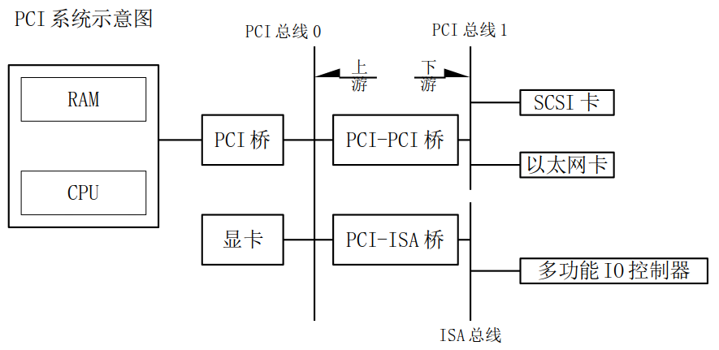

<font face=Simsun size=4>

# PCI设备基础知识

1. PCI总线结构介绍
    > PCI是外围设备互联(Peripheral Component Interconnect)的简称，作为一种通用的总线接口标准，在目前的计算机系统中的到了非常广泛的应用。PCI提供了一组完整的总线借口规范，其目的是描述如何将计算机系统中的外围设备以一种结构化、可控化的方式连接在一起，同时，PCI还刻画了外围设备在连接时的电气特性和行为规约，并且详细定义了计算机系统中的各个不同部件之间应该如何正确地进行交互  
    > <u>***PCI总线在X86体系中比较常见，ARM体系中基本没有PCI总线(RK3399内置PCI-E接口，支持基于PCI-E的高速WiFi和存储器扩展)***</u>  

    - PCI寻址
        PCI域：（16bit）
        总线号：（8bit）
        设备号：（5bit）
        功能号：（3bit）
        总线号、设备号和功能号共同组成PCI外围设备的<u>16bit硬件地址</u>
    > 但是由于256个总线对许多大系统是不够的Linux支持PIC域。每个PCI域可以占用多达256个总线，每个总线占用32个设备，每个设备可以是一个多功能卡（例如有个声卡设备带有一个附加的CD-ROM驱动）有最多8个功能  
    > 这样，Linux系统可以支持更过的PCI设备  
      

    ```shell
    $ lspci # 查看系统中当前存在的PCI设备
    01:00.0             3D controller: NVIDIA Corporation GM108M [GeForce 940MX] (rev a2)
    # 总线号：设备号：功能号
    ```

2. PCI配置寄存器及读写 (配置空间)
    每个PCI设备都有一个私有的至少256字节的地址空间（存在于PCI设备中的EEPROM中），前64字节是标准的（每个PCI设备都有），后面的空间依赖设备来配置  
    - 配置寄存器中包含了如下信息：  
        1. 此PCI设备的设备信息，如：厂商ID，设备ID等
        2. 此设备工作时需要的IO地址和mem地址起始地址以及长度
        3. 设备的IRQ号等  

    - 配置寄存器的作用  
        1. Linux内核启动时会从PCI设备的配置寄存器中读取内存/IO起始地址以及IRQ，并把这些信息赋值给struct pci_dev的相应成员
        2. PCI驱动也会读写配置寄存器获得/保存设备相关信息
    
    - 配置寄存器的初始化
        系统启动时，BIOS会为每个PCI设备分配内存、IO空间以及IRQ等，并写入相应的PCI设备的配置寄存器中去。  
        之后内核从配置寄存器中读取BIOS分配的相应数据  

3. IO端口和内存（x86平台IO端口与IO内存独立寻址）
    - 取得设备的io或mem
        > 此PCI设备用到了几个BAR？应该从哪个bar中读取所需的io地址或内存地址？  
        这些信息是硬件相关的，需要查阅凭此设备的datasheet才能得到以上信息。
    
    - 读取内存或io地址的函数：
    ```C
    unsigned long pci_resource_start(struct pci_dev *dev, int bar);

    unsigned long pci_resource_end(struct pci_dev *dev, int bar);

    unsigned long pci_resource_len(struct pci_dev *dev, int bar);
    // bar 的取值为 0~5
    unsigned long pci_resource_flags(struct pci_dev *dev, int bar);
    // 这个函数返回和这个资源相关联的标识
    // IORESOURCE_IO    IO端口
    // IORESOURCE_MEM   IO内存
    ```
    <u>***具体的IO端口与IO内存概念见笔记***</u>

    - ARM平台 (内存统一编址平台) 访问IO内存机制
        request_mem_region() -> ioremap()
        `先申请IO对应的物理地址登记到系统中，使用ioremap()映射 - 由于系统中使用了MMU，访问物理地址必须先映射`
            -> ioread8()    /   iowrite8()
            `对ioremap()返回地址进行操作`
                -> iounmap() -> release_mem_region()
                `取消映射，释放内存资源`
    - x86平台 (IO端口与IO内存独立编址平台)
        1. Linux系统内核提供了如下一些访问IO端口的内联函数（这种方式比较常用）
            ```C
            unsigned inb(unsigned port);
            void outb(unsigned char byte, unsigned port);
            
            unsigned inw(unsigned port);
            void outw(unsigned short word, unsigned port);

            unsigned inl(unsigned port);
            void outl(unsigned longword, unsigned port);
            ```
    - linux访问IO端口的新机制
        ```C
        // 使用统一接口访问IO端口或IO内存
        ioport_map()
            -> ioread8() / iowrite8()
                -> ioport_umap()
        ```

4. PCI设备初始化
    - PCI设备结构体
        ```C
        // 在 include/linux/pci.h 中定义
        // linux系统启动时会探测PCI设备，每探测到一个PCI设备就会创建一个pci_dev结构体并将相应的设备信息(资源、中断)填入结构体中
        struct pci_dev {
            struct list_head bus_list;  /* node in per-bus list */
            struct pci_bus  *bus;       /* bus this device is on */
            struct pci_bus  *subordinate;   /* bus this device bridges to */

            void        *sysdata;   /* hook for sys-specific extension */
            struct proc_dir_entry *procent; /* device entry in /proc/bus/pci */
            struct pci_slot *slot;      /* Physical slot this device is in */

            unsigned int    devfn;      /* encoded device & function index */
            unsigned short  vendor;
            unsigned short  device;
            unsigned short  subsystem_vendor;
            unsigned short  subsystem_device;
            unsigned int    class;      /* 3 bytes: (base,sub,prog-if) */
            u8      revision;   /* PCI revision, low byte of class word */
            ...
            struct pci_driver *driver;  /* which driver has allocated this device */
            u64     dma_mask;   /* Mask of the bits of bus address this
                                    device implements.  Normally this is
                                    0xffffffff.  You only need to change
                                    this if your device has broken DMA
                                    or supports 64-bit transfers.  */

            struct device_dma_parameters dma_parms;
            ...
            unsigned int    irq;    /* Interrupt number */
            struct resource resource[DEVICE_COUNT_RESOURCE]; /* I/O and memory regions + expansion ROMs */

        }

        // pci_driver结构体
        struct pci_driver {
            struct list_head node;
            const char *name;
            const struct pci_device_id *id_table;   /* must be non-NULL for probe to be called */
            int  (*probe)  (struct pci_dev *dev, const struct pci_device_id *id);   /* New device inserted */
            void (*remove) (struct pci_dev *dev);   /* Device removed (NULL if not a hot-plug capable driver) */
            int  (*suspend) (struct pci_dev *dev, pm_message_t state);  /* Device suspended */
            int  (*suspend_late) (struct pci_dev *dev, pm_message_t state);
            int  (*resume_early) (struct pci_dev *dev);
            int  (*resume) (struct pci_dev *dev);                   /* Device woken up */
            void (*shutdown) (struct pci_dev *dev);
            int (*sriov_configure) (struct pci_dev *dev, int num_vfs); /* PF pdev */
            const struct pci_error_handlers *err_handler;
            const struct attribute_group **groups;
            struct device_driver    driver;     // 所有驱动的基类
            struct pci_dynids dynids;
        };
        ```
    - PCI BUS结构体
        ```C
        // PCI设备与PCI驱动都是通过PCI_BUS管理
        struct pci_bus {
            struct list_head node;      /* node in list of buses */
            struct pci_bus  *parent;    /* parent bus this bridge is on */
            struct list_head children;  /* list of child buses */
            struct list_head devices;   /* list of devices on this bus */
            struct pci_dev  *self;      /* bridge device as seen by parent */
            struct list_head slots;     /* list of slots on this bus;
                            protected by pci_slot_mutex */
            struct resource *resource[PCI_BRIDGE_RESOURCE_NUM];
            struct list_head resources; /* address space routed to this bus */
            struct resource busn_res;   /* bus numbers routed to this bus */

            struct pci_ops  *ops;       /* configuration access functions */
            struct msi_controller *msi; /* MSI controller */
            void        *sysdata;   /* hook for sys-specific extension */
            struct proc_dir_entry *procdir; /* directory entry in /proc/bus/pci */

            unsigned char   number;     /* bus number */
            unsigned char   primary;    /* number of primary bridge */
            unsigned char   max_bus_speed;  /* enum pci_bus_speed */
            unsigned char   cur_bus_speed;  /* enum pci_bus_speed */
        #ifdef CONFIG_PCI_DOMAINS_GENERIC
            int     domain_nr;
        #endif

            char        name[48];

            unsigned short  bridge_ctl; /* manage NO_ISA/FBB/et al behaviors */
            pci_bus_flags_t bus_flags;  /* inherited by child buses */
            struct device       *bridge;
            struct device       dev;
            struct bin_attribute    *legacy_io; /* legacy I/O for this bus */
            struct bin_attribute    *legacy_mem; /* legacy mem */
            unsigned int        is_added:1;
        };
        ```
    - Linux中PCI设备的初始化
        1. BIOS启动时，会为每一个PCI设备分配地址和IRQ等信息，并写入各个PCI设备的配置寄存器中
        2. Linux系统启动时，会探测系统中的所有PCI设备，并为探测到的每一个PCI设备做如下操作：
           1. 分配一个struct pci_dev结构体，这个结构体表示一个PCI设备
           2. 为这个结构体填充设备 vendor id、device id、subvendor id、subdevice id以及地址和irq信息(通过读取PCI配置寄存器得到)
           3. 然后将这个struct pci_dev添加到pci_bus上

5. PCI驱动注册以及匹配
    - 驱动和设备的匹配
        当调用pci_register_driver(struct pci_driver *drv)时，系统会遍历PCI总线上的所有PCI设备，并将每个PCI设备和驱动进行匹配  
        `pci_bus_match->pci_match_device->pci_match_one_device`  
        ```C
        // pci_bus_match() pci_match_device() pci_match_one_device()在drivers/pci/pci-driver.c中定义

        /** 
        * pci_match_one_device - Tell if a PCI device structure has a matching                                                           
        *                        PCI device id structure
        * @id: single PCI device id structure to match
        * @dev: the PCI device structure to match against                                                                                
        *  
        * Returns the matching pci_device_id structure or %NULL if there is no match.
        */ 
        static inline const struct pci_device_id *       
        pci_match_one_device(const struct pci_device_id *id, const struct pci_dev *dev)
        {   
            if ((id->vendor == PCI_ANY_ID || id->vendor == dev->vendor) &&
                (id->device == PCI_ANY_ID || id->device == dev->device) &&
                (id->subvendor == PCI_ANY_ID || id->subvendor == dev->subsystem_vendor) &&
                (id->subdevice == PCI_ANY_ID || id->subdevice == dev->subsystem_device) &&
                !((id->class ^ dev->class) & id->class_mask))
                return id;
            return NULL;                        
        }   
        ```

6. platform驱动和PCI驱动的异同点  

|DeviceDrivers     |platform驱动   |PCI驱动
|------------------|---------------|------------|
|物理结构|虚拟总线，硬件上不存在，可用于所有平台|硬件上存在pci_bus,关于pci bus有相应的规范，主要用于x86系统|
|设备注册|需要手动调用platform_device_register()进行注册|Linux内核启动时自动探测所有PCI设备并注册到系统中|
|资源分配|根据硬件手册确定，硬件成型后就已经确定|BIOS为PCI设备分配内存、irq、IO等资源|
|设备和驱动的匹配方式|通过name来匹配|通过vendor id、device id来匹配|
</font>
