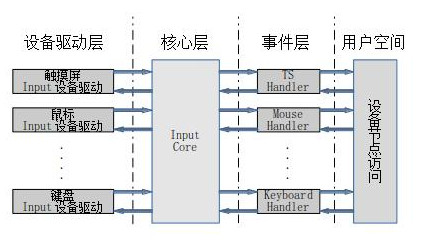
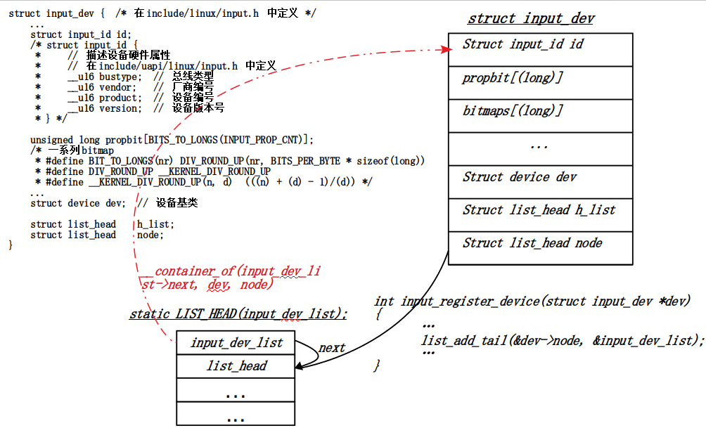
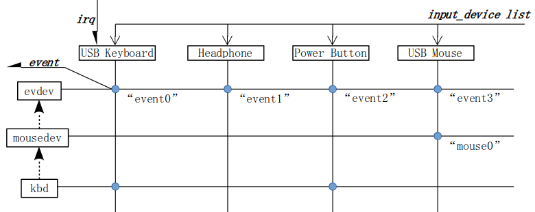
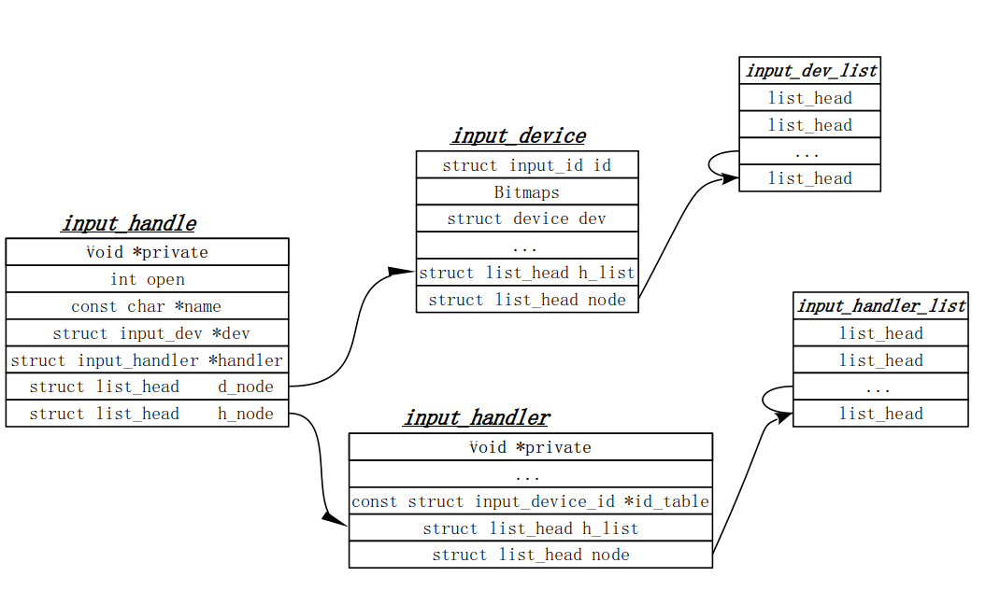

<font face=simsun size=3>

# Input设备驱动

## Input子系统
<u>*Input输入子系统结构图*</u> :  
  

> 输入子系统层：
> 为了对多种不同类别的输入设备(如键盘，鼠标，跟踪球，操纵杆，触摸屏
> 加速计和手写板)进行统一处理，内核在字符设备驱动上层抽象出的一层  

- 输入子系统由两类驱动程序组成：
    1. 事件驱动程序  
        **负责处理和应用程序的接口，向应用程序提供简单、统一的事件接口**
    2. 设备驱动程序  
        **负责和底层输入设备的通信**
    > 事件驱动程序是标准的，对所有的输入类都是可用的，所以不需要实现
    > 时间驱动，因为内核中已经支持所有的事件驱动；
    > 需要实现的是输入设备驱动程序

- 三个重要的结构体
    - struct input_dev
        <font color=red>代表Input输入设备</font>  
        <font color=green>代表底层的设备，比如图中的"USB keyboard"或"PowerButton"(PC的电源键), 所有设备的input_dev对象保存在一个全局的input_dev队列中</font>
        
          

    - struct input_handler
        <font color=red>代表输入设备的处理方法 - 输入事件</font>  
        <font color=green>input_handler代表某类输入设备的处理方法，比如
        evdev就是专门处理输入设备产生的Event(事件)，而"sysrq"是专门处理键盘
        上"sysrq"与其他按键组合产生的系统请求。所有的input_handler存放在
        input_handler队列中</font>  
        ***<u>一个input_dev可以有多个input_handler, 一个input_handler也可以用于多种输入设备</u>***

    - struct input_handle
        <font color=red>用来关联某个input_dev和input_handler</font>  
        <font color=green>每一个input_handle都会生成一个文件节点。endev的
        handle就对应与/dev/input下的文件"event0~xx"通过input_handle可以
        找到对应的input_handler和input_dev</font>  
      

    ```C
    struct input_dev {  /* 在include/linux/input.h 中定义 */
        ...
        struct input_id id;
        /* struct input_id {
         *     // 描述设备硬件属性
         *     // 在include/uapi/linux/input.h 中定义
         *     __u16 bustype;  // 总线类型
         *     __u16 vendor;   // 厂商编号
         *     __u16 product;  // 设备编号
         *     __u16 version;  // 设备版本号
         * } */

        unsigned long propbit[BITS_TO_LONGS(INPUT_PROP_CNT)];
        /* 一系列bitmap
         * #define BITS_TO_LONGS(nr) DIV_ROUND_UP(nr, BITS_PER_BYTE * sizeof(long))
         * #define DIV_ROUND_UP __KERNEL_DIV_ROUND_UP
         * #define __KERNEL_DIV_ROUND_UP(n, d)  (((n) + (d) - 1)/(d)) 
         * -----
         * BITS_TO_LONGS(nr) --> (nr + 32 - 1) / 32
         */
        ...
        struct device dev;  // 设备基类

        struct list_head    h_list;
        struct list_head    node;
    }
    struct input_handler{
        void *private;  // 结构体私有成员
        // handler函数 事件驱动
        ...
        const struct input_device_id *id_table;
        /* input_handler 为事件驱动
         * input_device_id 中的内容为 能够处理的事件和类型 */
        struct list_head h_list;    // 作为一个节点链接到队列中 - 内容为input_handle结构体
        struct list_head node;
    }
    struct input_handle {   // 表示一个input_dev 与一个input_handler 的对应关系
        void *private;

        int open;
        const char *name;

        struct input_dev *dev;
        struct input_handler *handler;

        struct list_head    d_node; // 链接到device链表中
        struct list_head    h_node; // 链接到handler链表中
    };
    ```
- Input事件驱动实例 ——/drivers/input/evdev.c
    > input 事件驱动不需要编写，系统已经提供了，例如 evdev、mousedev、keyboard等  
    ```C
    struct evdev {
        int open;
        struct input_handle handle;
        wait_queue_head_t wait;
        struct evdev_client __rcu *grab;
        struct list_head client_list;
        spinlock_t client_lock; /* protects client_list */
        struct mutex mutex;
        struct device dev; 
        struct cdev cdev;   // file_operations 在这里包含 新版本内核与旧版本不同 ！！！
        bool exist;
    };
    ```
    ```C
    /* 函数input_register_handler()分析 */
    int input_register_handler(struct input_handler *handler)
    {
        struct input_dev *dev;
        ...
        list_for_each_entry(dev, &input_dev_list, node)
        /* #define list_for_each_entry(pos, head, member)              \
         *     for (pos = __container_of((head)->next, pos, member);   \
         *         &pos->member != (head);                             \
         *         pos = __container_of(pos->member.next, pos, member))
         * 
         * #define __container_of(ptr, sample, member)             \
         *     (void *)container_of((ptr), typeof(*(sample)), member)
         * 
         * #ifndef container_of
         * #define container_of(ptr, type, member) \
         *     (type *)((char *)(ptr) - (char *) &((type *)0)->member)
         * #endif   */
        // 带入参数
        /* for(dev = __container_of((input_dev_list->next, dev, node)); dev->node != input_dev_list; dev = __container_of(dev->node.next, dev, node))
         * // dev->node != input_dev_list   判断是否到链表头(循环结束)
         *     input_attach_handler(dev, handler);  // device与handler的匹配函数 在for循环成立时执行
         *     
         * __container_of(input_dev_list->next, dev, node)
         * ---> (void *)container_of(input_dev_list->next, typeof(dev), node)
         * ---> (struct input_dev *)((char *)(input_dev_list->next) - (char *)((struct input_dev *)0)->node)
         */

            input_attach_handler(dev, handler);
            /* static int input_attach_handler(struct input_dev *dev, struct input_handler *handler)
             * {
             *     const struct input_device_id *id; 
             *     int error;
             * 
             *     id = input_match_device(handler, dev);
             *     if (!id)
             *         return -ENODEV;
             * 
             *     error = handler->connect(handler, dev, id); 
             *     if (error && error != -ENODEV)
             *         pr_err("failed to attach handler %s to device %s, error: %d\n",
             *             handler->name, kobject_name(&dev->dev.kobj), error);
             * 
             *     return error;
             * }    */
        ...
    }
    ```
    ```C
    static int evdev_connect(struct input_handler *handler, struct input_dev *dev,
             const struct input_device_id *id)
    {
        ...
        input_register_handle(&evdev->handle);
        /* input_register_handle(struct input_handle *handle)  // 函数中的操作
         * {
         *     ...
         *     list_add_tail_rcu(&handle->d_node, &dev->h_list);
         *     // 将 handle->d_node添加至 dev->h_list尾部
         *     list_add_tail_rcu(&handle->h_node, &handler->h_list);
         *     // 将 handle->h_node添加至 handler->h_list尾部
         *     ...
         * } */

    }
    ```
      

- Input设备驱动实例 ——/drivers/hid/usbhid/usbmouse.c
    ```C
    struct input_event{     // /include/uapi/linux/input.h 中定义
        struct timeval time;
        __u16 type;
        __u16 code;
        __s32 value;
    }
    ```
    event读取函数evdev中实际调用copy_to_user()

    在Linux中，Input设备用input_dev结构体描述，定义在input.h中。设备的驱动只需要按照如下步骤注册即可：
    1. 分配一个struct input_dev：
        struct input_dev *input_dev;
    2. 初始化input_dev这个结构体
    3. 注册这个input_dev设备
        input_register_device(dev);
    4. 在Input设备发生输入操作时(如：按键按下/抬起、鼠标移动等)，提交所发生的事件以及对应的键值或坐标状态等。
    > input_report_*()  函数向上层报告事件

    ```C
        /* USB Mouse设备注册 */
        // drivers/hid/usbhid/usbmouse.c 中对usbmouse驱动的定义
        module_usb_driver(usb_mouse_driver);
        
        /* #define module_usb_driver(__usb_driver) \
         *     module_driver(__usb_driver, usb_register, \
         *         usb_deregister)
         */
        
        #define module_driver(__driver, __register, __unregister, ...) \
        static int __init __driver##_init(void) \
        { \
            return __register(&(__driver), ##__VA_ARGS__);  \
        } \
        module_init(__driver##_init);    \
        static void __exit __driver##_exit(void)    \
        { \
            __unregister(&(__driver), ##__VA_ARGS__); \
        } \
        module_exit(__driver##_exit);

        // 即存在 注册函数
        module_init(usb_mouse_driver_init);
            usb_register(&(usb_mouse_driver), ##__VA_ARGS__);
        /* 
         * #define usb_register(driver) \
         *     usb_register_driver(driver, THIS_MODULE, KBUILD_MODNAME)
         * extern int usb_register_driver(struct usb_friver *, struct module *,
         *                                const char *);
         */
            usb_register_driver(&(usb_mouse_driver), THIS_MODULE, KBUILD_MODNAME);

        // 取消注册函数
        module_exit(usb_mouse_driver_exit);
            usb_deregister(&(usb_mouse_driver), ##__VA_ARGS__);
        /* extern void usb_deregister(struct usb_driver *); */
    ```
    ```C
    static int usb_mouse_probe(struct usb_interface *intf, const struct usb_device_id *id)
    {
        /* USB Mouse设备注册成功后进入 probe 函数进行初始化 */

        // 在probe 函数中初始化 struct input_dev
        input_dev->evbit[0] = BIT_MASK(EV_KEY) | BIT_MASK(EV_REL);
        input_dev->keybit[BIT_WORD(BTN_MOUSE)] = BIT_MASK(BTN_LEFT) |
                            BIT_MASK(BTN_RIGHT) | BIT_MASK(BTN_MIDDLE);
        input_dev->relbit[0] = BIT_MASK(REL_X) | BIT_MASK(REL_Y);
        input_dev->keybit[BIT_WORD(BTN_MOUSE)] |= BIT_MASK(BTN_SIDE) |
                            BIT_MASK(BTN_EXTRA);
        input_dev->relbit[0] |= BIT_MASK(REL_WHEEL);

        /* struct input_dev{
         *     ...
         *     // evbit 表示支持的事件类型
         *     unsigned long evbit[BITS_TO_LONGS(INPUT_PROP_CNT)];
         * 
         *     // 以下 bitmaps 表示具体事件类型下事件的编码
         *     unsigned long keybit[BITS_TO_LONGS(KEY_CNT)];    // 按键事件
         *     unsigned long relbit[BITS_TO_LONGS(REL_CNT)];    // 相对坐标事件
         *     unsigned long absbit[BITS_TO_LONGS(ABS_CNT)];    // 绝对坐标事件
         *     unsigned long mscbit[BITS_TO_LONGS(MSC_CNT)];
         *     unsigned long ledbit[BITS_TO_LONGS(LED_CNT)];
         *     unsigned long sndbit[BITS_TO_LONGS(SND_CNT)];
         *     unsigned long ffbit[BITS_TO_LONGS(FF_CNT)];
         *     unsigned long swbit[BITS_TO_LONGS(SW_CNT)];
         *     ...
         * }
         * 
         * #define BITS_PER_LONG        8
         * 
         * BIT_WORD()
         * // 根据 bit位计算出nr在数组中第几个元素
         * #define BIT_WORD(nr)        ((nr) / BITS_PER_LONG)
         * 
         * BIT_MASK()
         * // 已知需要设定的bit在数组中的位置后找到具体的 bitmaps对应的bit位
         * #define BIT_MASK(nr)        (1UL << ((nr) % BITS_PER_LONG))
         */

        // 最后使用input_register_device() 函数将input设备注册到内核中
        error = input_register_device(mouse->dev);
        if(error)
            goto fail3;
        ...
    /* int input_register_device(struct input_dev *dev) // 注册Input_dev函数
     * {
     *     ...
     *     // 与 evdev 注册函数大同小异
     *     list_add_tail(&dev->node, &input_dev_list);
     *     list_for_each_entry(handler, &input_handler_list, node)
     *         // 匹配设备与驱动函数
     *         input_attach_handler(dev, handler);
     *         
     *     ...
     * }
     */
    }
    ```

- 输入事件从底层到上层的传递过程 && input设备数据流向
- 
</font>