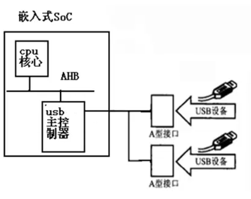
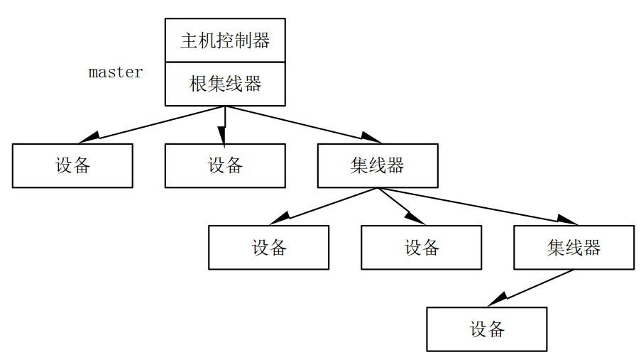
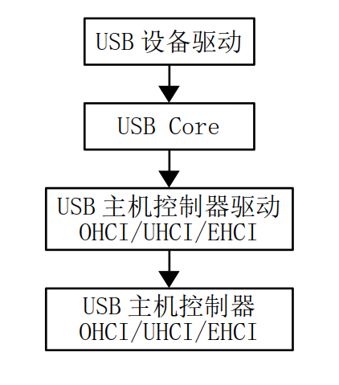
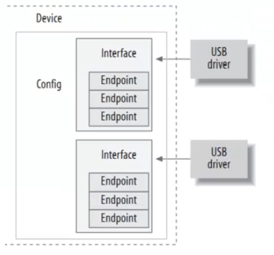
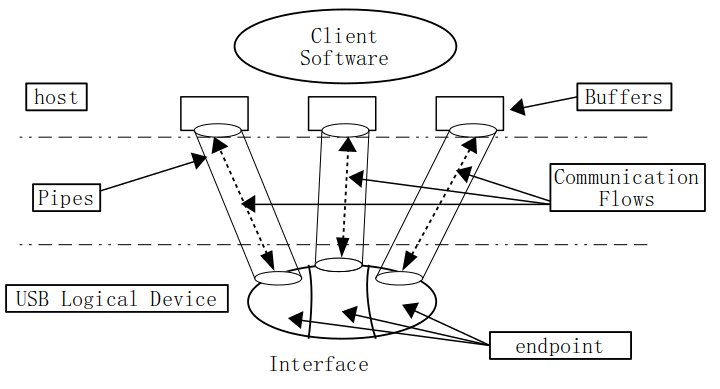

# USB 设备驱动  
`Universal Serial Bus (通用串行总线)`  

---
1. USB概念概述
    > ARM 平台下的USB总线接口  

    - USB接口定义  
        `Universal Serial Bus (通用串行总线)`  

    - USB硬件连接
          
        ***<u>Linux内核中的USB设备驱动包括USB主控制器驱动与USB设备驱动两部分</u >***  

    - USB主控制器类型
        > USB主控制器内嵌一个叫根集线器的硬件  

        1. UHCI `Intel提出，基于Intel的PC机一般使用这种主控制器，支持usb1.1标准`
        2. OHCI `康柏和微软提出，兼容OHCI的控制器，硬件智能程度比UHCI高，支持usb1.1标准`
        3. EHCI `支持USB2.0标准，同时兼容UHCI和OHCI`
        4. XHCI `支持最新的USB3.0标准，同时兼容UHCI、OHCI与EHCI`
        
    - USB标准
        1. USB1.0   低速(Low Speed)		1.5	Mbps
        2. USB1.0   全速(Full Speed)	12	Mbps
        3. USB2.0   高速(High Speed)	480	Mbps
        4. USB3.0   超高速(Super Speed)	 4.8	Gbps
        
    - USB总线结构
        > USB总线采用master/slave式的总线拓扑结构，所有的事务都是由主控制器发起的  

        
        为每个设备编一个地址，主控制器即可通过地址访问设备  
    - USB OTG技术简介
        > 既能作为USB设备被计算机读取数据，又能作为主设备读取插入的USb设备  
        > ***OTG(On-The-Go), 即可以做主也可以做从，主要是为嵌入式设备准备的，由于USB是一种主从系统，不能支持点对点的平等的传输数据，OTG正是在这种需求下产生的，OTG不仅支持控制器的主从切换，在一定程度上也支持相同设备之间的数据交换***
    - USB 热插拔的硬件实现  
        <font face=simsun color=red>
        　　USB 主机是如何检测到设备的插入的？  
        　　首先，在USB集线器的每一个下游端口的D+和D-上，分别接了一个15KΩ的下拉电阻到地。这样，在集线器的端口悬空时，就被这两个下拉电阻拉到了低电平。而在USB设备端，在D+或者D-上接了1.5KΩ上拉电阻，对于全速和高速设备，上拉电阻是接在D+上，而低速设备则是上拉电阻接在D-上。这样当设备而插入到集线器时，由1.5K上拉电阻和15K下拉电阻分压，结果就将差分数据线中的一条拉高。集线器检测到这个状态后报告给USB主控制器(或者通过踏上一层的集线器报告给USb主控制器)，这样就实现了检测设备的插入。  
        　　USB高速设备先是被识别为全速设备，然后通过Host和Device两者通信，确认后再切换到高速模式的。
        </font>

2. USB主控制器驱动
    - 主控制器驱动功能
        1. 解析和维护URB
            > URB: USB Repuest Block, 数据通信的格式

        2. 负责不同USB传输类型的调度工作
        3. 负责USB数据的实际传输工作
            > USB设备为主从式

        4. 实现虚拟根HUB功能

    - 硬件存在 - 集成在SOC中
        > 硬件厂商会提供USB主控制器驱动

    - 驱动架构
        
        > ***<u>USB主控制器驱动文件位于　drivers/usb/host</u>***  

        驱动文件命名规则：
        *HCI-*.c  遵循*HCI标准的主控制器
        > 例：ehci-exynos.c　三星Exynos系列处理器USB Host EHCI 控制器驱动　　
        ***<u>/drivers/usb/host/ehci-exynos.c</u>***
        ```C
        // 可以看到是一个平台驱动的架构
        static struct platform_driver ohci_hcd_s3c2410_driver = {
            .probe      = ohci_hcd_s3c2410_probe,
            .remove     = ohci_hcd_s3c2410_remove,
            .shutdown   = usb_hcd_platform_shutdown,    
            .driver     = {
                .name   = "s3c2410-ohci",
                .pm = &ohci_hcd_s3c2410_pm_ops,
                .of_match_table = ohci_hcd_s3c2410_dt_ids,
            },
        };
        ```
        ## ***<u> 平台设备的注册一般都是在/arch/arm目录下进行　！！！ </u>***
        > s3c2410-ohci 平台设备注册可以在 /arch/arm/plat-samsung/devs.c
        ```C
        struct platform_device s3c_device_ohci = {
            .name           = "s3c2410-ohci",
            .id             = -1,
            .num_resources  = ARRAY_SIZE(s3c_usb_resource),
            .resource       = s3c_usb_resource,
            /*
            static struct resource s3c_usb_resource[] = {
                [0] = DEFINE_RES_MEM(S3C_PA_USBHOST, SZ_256),
                [1] = DEFINE_RES_IRQ(IRQ_USBH),
            };
            */
            .dev            = {
                .dma_mask           = &samsung_device_dma_mask,
                .coherent_dma_mask  = DMA_BIT_MASK(32),
            }
        };
        ```

3. USB设备驱动
    > USB 鼠标驱动  usbmouse.c  
    > 常见USB 设备：USB鼠标、USB键盘、USB硬盘、USB网卡等  

    - USB驱动相关概念
        > USB设备与PCI设备相似，内部也有一个eeprom存放USB设备相关信息，称为<u>***描述符***</u>
        ```Shell
        $ lsusb  # 列出系统上所有USB设备
        $ lsusb -v  # 列出系统当前所有USB设备及其描述符
        ```
        - 描述符类型
            1. 设备描述符
                > struct usb_device_descriptor  
                > 厂商信息、产品ID等
            2. 配置描述符
                > struct usb_config_descroptor  
                > 配置信息
            3. 接口描述符
                > struct usb_interface_descriptor
                > 接口功能信息
                <font color=red>
                ## ***<u>驱动是绑定在USB接口上，而不是设备上</u>***
                </font>
            4. 端点描述符
                > struct usb_endpoint_descriptor
                > 底层通信细节

    - USB设备描述符具体分析
        > 在4.15版本内核中USB设备描述符定义代码位于 include/uapi/linux/usb/ch9.h
		> 存放设备的普通信息，包括产品ID、设备ID、序列号以及配置数目(bNumConfigurations)
        ```C
        /* USB_DT_DEVICE: Device descriptor 定义的内容与usb规范相符合 */  
        struct usb_device_descriptor {
            __u8  bLength;
            __u8  bDescriptorType;

            __le16 bcdUSB;
            __u8  bDeviceClass;
            __u8  bDeviceSubClass;
            __u8  bDeviceProtocol;
            __u8  bMaxPacketSize0;
            __le16 idVendor;
            __le16 idProduct;
            __le16 bcdDevice;
            __u8  iManufacturer;
            __u8  iProduct;
            __u8  iSerialNumber;
            __u8  bNumConfigurations;   // 表示设备中有多少配置选项
        } __attribute__ ((packed));     
        /*  
            1. 字节对齐指令，成对出现
            # pragma pack(n)    // n字节对齐
            # pragma pack()     // 取消之前声明的n字节对齐

            2. 对于单个结构体
            __attribute__((packed))     // 取消结构体在编译过程中的优化对齐
            __attribute__((aligned(n))) // 让所有结构体成员对齐在n字节自然边界上，如果在结构体中有成员长度大于n则按照最大成员的长度对齐
        */
        ```
    - 配置描述符
		> 包含每个配置可用的接口数目(bNumInterfaces)和该配置运行时需要的最大功耗(bMaxPower)，一般而言, 一个USB设备只包含一个配置
        ```C
        /* USB_DT_CONFIG: Configuration descriptor information.
        *
        * USB_DT_OTHER_SPEED_CONFIG is the same descriptor, except that the
        * descriptor type is different.  Highspeed-capable devices can look
        * different depending on what speed they're currently running.  Only
        * devices with a USB_DT_DEVICE_QUALIFIER have any OTHER_SPEED_CONFIG
        * descriptors.
        */
        struct usb_config_descriptor {
            __u8  bLength;
            __u8  bDescriptorType;

            __le16 wTotalLength;
            __u8  bNumInterfaces;
            // 这个配置下有几个接口数
            // USB规范中每一个接口表示一个USB功能

            __u8  bConfigurationValue;
            __u8  iConfiguration;
            __u8  bmAttributes;
            __u8  bMaxPower;
        } __attribute__ ((packed));
        ```

    - 接口描述符
		> USB 设备厂商生产USB设备时按照USB规范在USB设备中存放信息  
		> Linux内核中按照USB规范定义结构体
		<font color=red>
		## ***<u>"接口"表示的是USB设备的功能(Functions)</u>***
		</font>
		```C
		/* USB_DT_INTERFACE: Interface descriptor */
		struct usb_interface_descriptor {
			__u8  bLength;
			__u8  bDescriptorType;

			__u8  bInterfaceNumber;
			__u8  bAlternateSetting;
			__u8  bNumEndpoints;		// 表示USB设备端点数
			__u8  bInterfaceClass;
			__u8  bInterfaceSubClass;
			__u8  bInterfaceProtocol;
			__u8  iInterface;
		} __attribute__ ((packed));
		```
	- 端点描述符
		> 端点是USB通信的基本单位  
		> 端点描述符 存放设备的端点信息
		```C
		// Linux内核使用 usb_endpoint_descriptor来描述一个端点
		/* USB_DT_ENDPOINT: Endpoint descriptor */
		struct usb_endpoint_descriptor {
			__u8  bLength;				// 描述符的字节长度
			__u8  bDescriptorType;		// 描述符类型，对于端点就是 USB_DT_ENDPOINT

			__u8  bEndpointAddress;		// [3:0]bit 表示端点地址
										// 8bit		表示方向（输入或输出）
			__u8  bmAttributes;			// 表示属性，其中 [1:0]bit 共同称为 Transfer Type即传输类型
										// 00 - 控制	01 - 等时	10 - 批量	11 - 中断
			__le16 wMaxPacketSize;		// 端点一次可以处理的最大字节数
			__u8  bInterval;			// 希望主机轮询自己的事件间隔

			/* NOTE:  these two are _only_ in audio endpoints. */
			/* use USB_DT_ENDPOINT*_SIZE in bLength, not sizeof. */
			__u8  bRefresh;
			__u8  bSynchAddress;
		} __attribute__ ((packed));
		```
	- 描述符的关系  
		> 设备通常具有一个或多个配置  
		> 配置经常具有一个或多个接口  
		> 接口 没有或有一个以上的端点  
		
	
	- 端点 endpoint
		- USB设备是通过端点(endpoint) 进行的  
		- 端点是USB通信的基本形式
		- 端点只能在一个方向上传输数据，或者IN或着OUT
			> 端点0除外，首次通信时通过端点0读取信息
		- 端点存在与USB设备端
			> USB设备与主机控制器通信只能依赖于端点
		- 主机与端点之间的通信通过***管道***  
			

	- USB的传输模式
    	> 不同的设备对于传输数据有各自的要求  

		1. 控制传输
			> 获取 / 配置设备
		2. 中断传输
			> 例如USB鼠标  
			> `这里说的终端和硬件上下文中的中断不同，不是设备主动发送的一个中断请求，而是主机控制器在保证不大于某一个时间间隔内安排的一次传输`，即由主机产生的定时中断  
			> 中断定时在结构体成员 ***`usb_endpoint_descriptor->bInterval`*** 中定义
		3. 批量传输
			> 用于大容量数据传输，没有固定的传输速率，例如USB打印机、扫描仪，大容量存储设备、U盘等
		5. 等时传输
			> 可以传输大批量数据，但是不能保证数据是否达到，用于对实时性要求较高的场合，例如音视频等设备

	- usb repuest block, urb
		- USB 主控制器和USB外设通信协议
		- 中控制器发送urb的方式
    		- 同步方式
    		- 异步方式